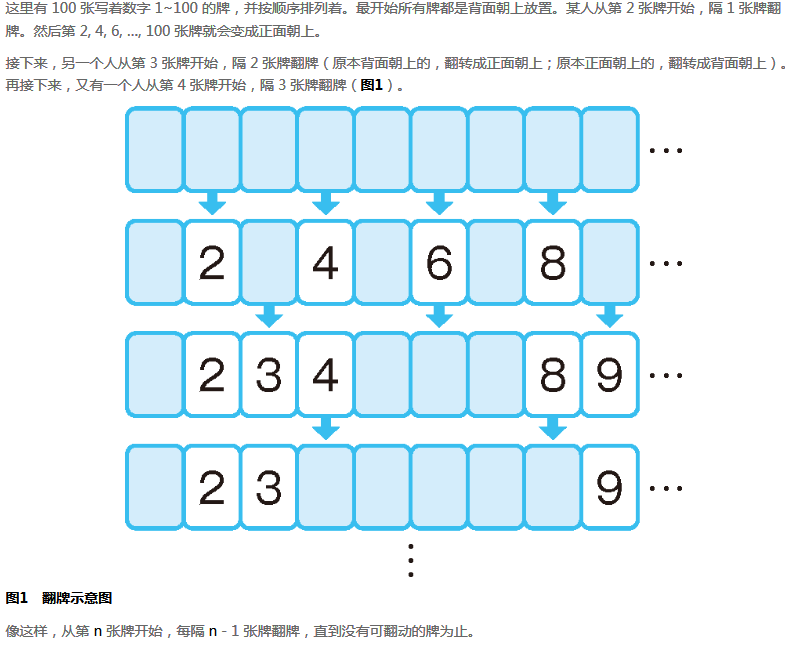

## 问题



> 问题：**求当所有牌不再变动时，所有背面朝上的牌的数字。**


## 主要思路

- 用布尔量来表示牌是否被翻开，所以默认为`false`；每次翻牌操作都会改变其状态。

- 也可以用翻牌次数来表示该牌是否被翻开，翻拍次数为偶数则表示没被翻开，反之为奇数则表示被翻开！

- 主要操作用循环即可解决

- 如何在`js`中创建一个元素一致的数组？可以使用`ES6`新增的数组函数`fill()`：

  ```js
  let status = new Array(100).fill(false); // 表示声明了一个数组大小为100且元素全为false的数组
  ```

  `fill()`还有两个可选参数来表示填充的起始位置（`start`）和结束位置（`end`），表示填充数组索引为`[start,end)`之间的元素（注意不包括最后索引为`end`的元素）！

## 参考文档

1. [数组的扩展 - ECMAScript 6入门](http://es6.ruanyifeng.com/#docs/array#%E6%95%B0%E7%BB%84%E5%AE%9E%E4%BE%8B%E7%9A%84-fill)

