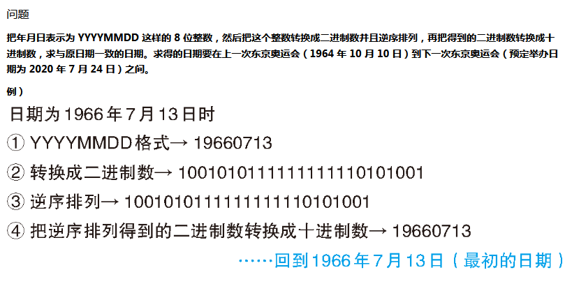

## 问题描述



## 主要思路

- 思路很简单，也就是进制转换和颠倒，主要是在`js`中把二进制转化为十进制可以用`parseInt()`函数：

```js
parseInt(n.toString(2).split("").reverse().join(""), 2);
```

- 从某个时间点到另一个时间点进行循环，手动的话比较麻烦，有现成的时间库可以使用；我选择[day.js](https://github.com/xx45/dayjs)，这个库比较简洁，而且还有中文文档；不过貌似有个bug，就是当处于`1970-1-1`这一天时，往后增加一天会变成`5759-11-30`，所以需要在循环过程中手动矫正为`1970-1-2`！

  ```js
  console.log(dayjs('1970-1-1').add(1, 'day').format('YYYYMMDD')); // 57591130
  ```