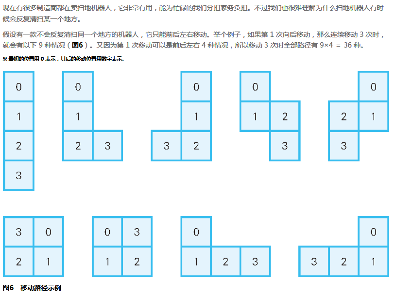

## 问题描述



问题：**求这个机器人移动 12 次时，有多少种移动路径？**


## 主要思路

- 由于不能走重复区域，所以第`n`步的走法受限于前`n-1`步的位置
- 很自然的想到**树**这种结构，按层级分布，以出发点（可以设置出发点的位置为`(0, 0)`）为根结点，每一个路径都是由根结点出发，下一步路径结点与该路径的前面的结点有关；即使用**深度优先遍历**的思想，最后得到第`n`层的结点数即可（按根结点为第`0`层算）
- 由于每一步都与前面已有的路径相关，所以很自然的可以使用递归


## 疑问

- 使用数组对象`Array`的`indexOf`和新增的`includes`函数无法对类型为**数组**的子元素进行判断？

```js
const direction = [
    [0, 1],
    [0, -1],
    [-1, 0],
    [1, 0]
];

console.log(direction.includes([1, 0])); // false
console.log(direction.indexOf([1, 0])); // -1
```