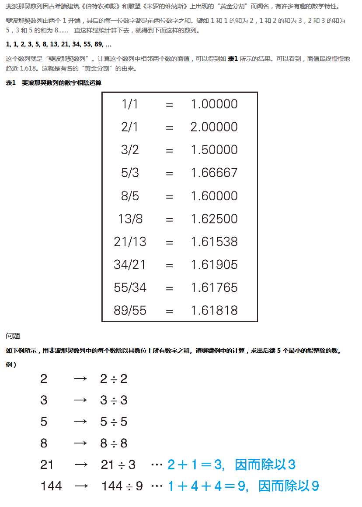

## 问题描述



## 主要思路

- 只需要构造出斐波拉契数列即可，构造斐波拉契数列的诀窍就是后一项等于前两项之和；
- 可以利用递归，也可以直接利用变量不停地迭代
- 迭代交换新的数列项时，可以使用`ES6`的变量解构特性来快速实现变量交换：

```js
let [x, y] = [1, 2]; // 实现x，y一起赋值

[x, y] = [y, x]; // 实现x和y的值进行交换
```


## 参考文档

1. [变量的解构赋值 - ECMAScript 6入门](http://es6.ruanyifeng.com/#docs/destructuring)