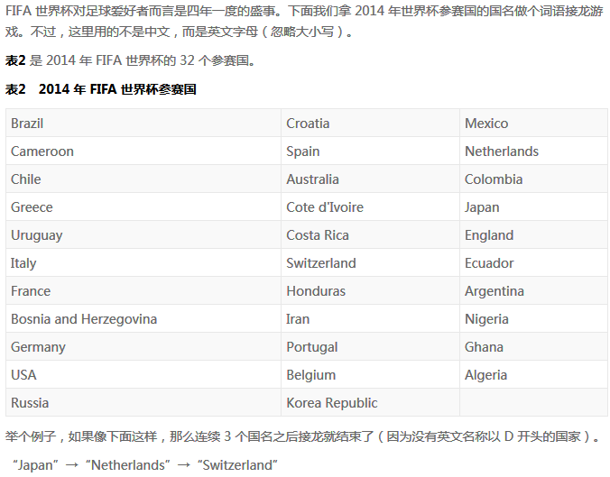

## 问题描述

问题：**假设每个国名只能使用一次，求能连得最长的顺序，以及相应的国名个数。** 

## 主要思路

- 国名单词的接龙关键在于能够首尾相连的单词存在着一种『联系』
- 用来描述某种『联系』，就会马上想到『图』这种数据结构
- 首先以单词的首字符对所有单词进行归类，即首字符相同的单词为一组；然后以国名作为结点，该国名单词所能连接的国名即为该结点的邻接结点，所以可以用邻接表的方式来构造图的结构；
- 然后可以使用**深度优先搜索**来查找最长路径即可