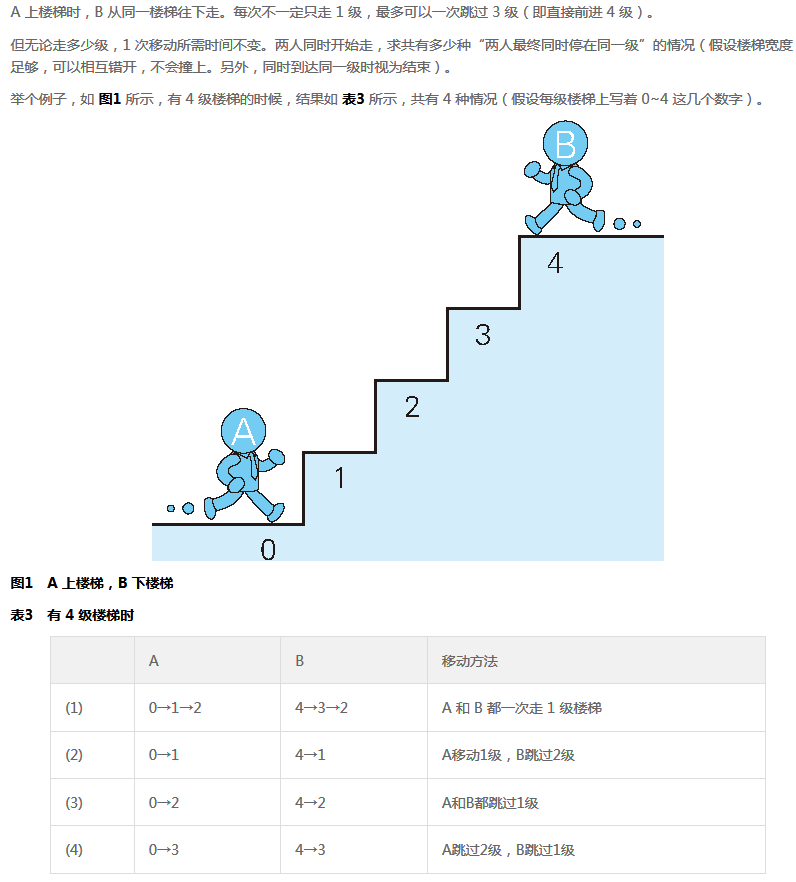

## 问题描述

问题：**求当存在 10 级楼梯，且移动规则相同时，有多少种两人最终同时停在同一级的情况？** 

## 主要思路

- 首先最容易想到的就是递归法，直接对`A`和`B`所处的阶梯数进行判断，用循环将**每一次操作所改变的阶数**进行递归；但是递归法**本身很耗内存**，因此当阶数`n`变大后运行得特别慢。
- 还可以使用**动态规划法**（不知概念是否用错），即通过将`A`在第`i`次操作后在每个楼梯有**多少种走法（0即代表当前操作下不可能处于这个阶层）**用数组存起来，然后第`i+1`依赖于第`i`次的状态，以此类推，即可得出每次操作后`A`的所处楼梯的状态，且在这里`B`的状态与`A`是对称的（这里的对称指的就是`A`是上楼梯，`B`是下楼梯，所以`A`的状态对于`B`来说就是下楼梯步数的状态），即`A[n-i]=B[i]`！

> 动态规划算法是通过拆分问题，定义问题状态和状态之间的关系，使得问题能够以递推（或者说分治）的方式去解决。
>
> 动态规划算法的基本思想与分治法类似，也是将待求解的问题分解为若干个子问题（阶段），按顺序求解子阶段，前一子问题的解，为后一子问题的求解提供了有用的信息。在求解任一子问题时，列出各种可能的局部解，通过决策保留那些有可能达到最优的局部解，丢弃其他局部解。依次解决各子问题，最后一个子问题就是初始问题的解。 

- 通过动态规划法的思路可以将时间复杂度降为`O(n^2)`；