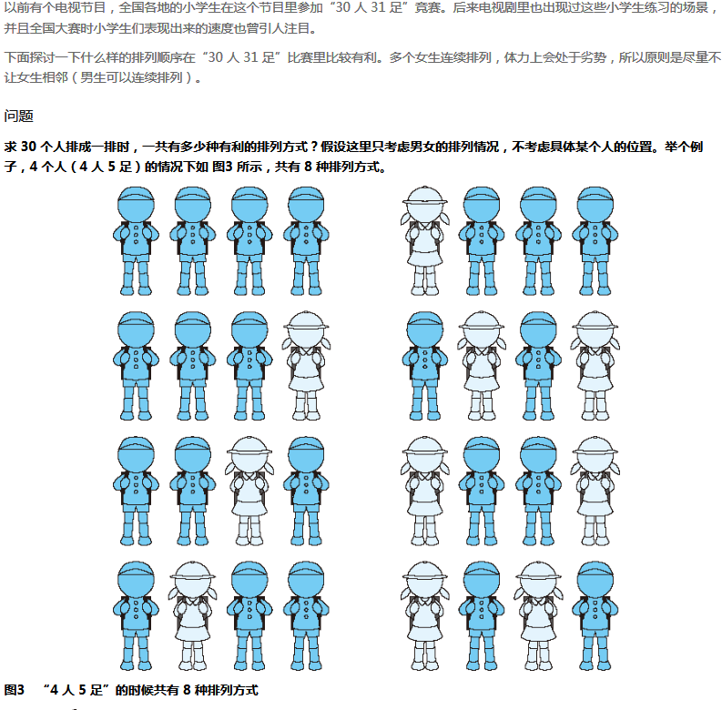
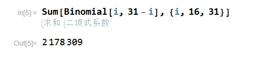

## 问题描述

## 主要思路

1. 所谓的的『有利』条件就是不能出现女生连续排列的情况，因此可以看做将『女生』安插到『男生』之间的空隙中，且每个『空隙』只能用一次！
2. 假设男生`n`人，女生`m`人，有利的排列情况就有`C(n+1,m)`种（组合方法）；很明显，当女生人数超过男生人数时是不可能不出现女生连续排列的情况，因此`n>=15`，所以有利情况的总和即为`C(i, 31-i)`之和，其中`i`的范围为`[16, 31]`；
3. 使用`Mathematica`只需一行代码即可：

